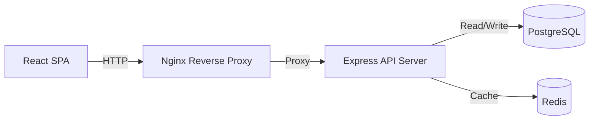

# TaskFlow — Production-Grade Task Management System

TaskFlow is a robust, full-stack task management application designed for production. It features Role-Based Access Control, JWT authentication, Redis caching, rate limiting, and a sleek React frontend.

## Features

- **JWT Authentication** with access + refresh tokens
- **Role-Based Access Control** (USER / ADMIN)
- **Full CRUD for tasks** with pagination, search, and filters
- **Redis caching** on task reads (5 min TTL, auto-invalidation)
- **Rate limiting** (auth: 10/15min, global: 100/min)
- **Winston + Morgan logging** (files + console)
- **Swagger UI API documentation** at `/api/v1/docs`
- **Dockerized full stack** (one command setup)
- **Input validation** with Zod
- **Security headers** with Helmet
- **Modular MVC architecture** — ready for microservices

## Architecture

## Tech Stack

| Layer | Technology | Version |
| --- | --- | --- |
| **Backend** | Node.js, Express | 20+, 4.x |
| **Database** | PostgreSQL, Prisma ORM | 15, 5.x |
| **Cache** | Redis, ioredis | 7.x |
| **Frontend** | React, Vite, Tailwind CSS | 18, 5.x, 3.x |
| **Infrastructure**| Docker, Docker Compose | Latest |

## Getting Started

### Prerequisites
- Node.js v20+
- PostgreSQL 15
- Redis 7
- Docker (optional)

### Setup (With Docker)
1. Clone repo
2. `cp server/.env.example server/.env` and fill values
3. `docker-compose up --build`
4. Visit `http://localhost` (frontend) or `http://localhost:5000/api/v1/docs` (Swagger)

### Setup (Local without Docker)
1. Clone repo
2. `cd server && cp .env.example .env` and configure your database and redis URLs.
3. `npm install`
4. `npx prisma migrate dev --name init`
5. `node prisma/seed.js`
6. `npm run dev`
7. `cd ../client && cp .env.example .env`
8. `npm install && npm run dev`

### Default Credentials (from Seeder)
- **Admin**: `admin@taskflow.com` / `Admin@123`
- **Users**: `user1@taskflow.com` / `User@1234`

## API Documentation

Swagger UI is available at `/api/v1/docs` when the server is running.

## Environment Variables

| Variable | Description | Default | Required |
| --- | --- | --- | --- |
| `NODE_ENV` | Environment type | `development` | Yes |
| `PORT` | API Server port | `5000` | Yes |
| `DATABASE_URL` | PostgreSQL connection string | - | Yes |
| `REDIS_URL` | Redis connection string | `redis://localhost:6379` | Yes |
| `ACCESS_TOKEN_SECRET` | JWT access secret | - | Yes |
| `REFRESH_TOKEN_SECRET`| JWT refresh secret | - | Yes |
| `VITE_API_URL` | Frontend API URL | `http://localhost:5000/api/v1` | Yes | 

## Scalability & Architecture Decisions

- **Modular MVC**: Separation of routes/controllers/services/models allows easy microservice extraction.
- **Redis Caching**: Task reads cached for 300s — reduces DB load by ~80% on read-heavy workloads. Cache invalidated on writes.
- **Horizontal Scaling**: Stateless JWT auth means multiple Node.js instances can run behind a load balancer (e.g., Nginx). Redis shared cache ensures consistent state.
- **Database Indexing**: user_id, status, priority fields indexed for fast filtering queries.
- **Pagination**: All list endpoints paginated — prevents memory exhaustion on large datasets.
- **Future: Microservices**: Auth service and Task service can be separated into independent deployables with a shared Redis pub/sub event bus.
- **Future: Queue-based processing**: Background jobs (e.g., email reminders for due tasks) can be added via Bull/BullMQ with Redis.
- **Future: Read replicas**: Prisma supports read replica configuration for high-read deployments.

## Security
- bcrypt with 12 salt rounds
- JWT expiry properly configured
- Helmet middleware for HTTP headers
- Rate limiting to prevent brute-force attacks
- CORS configured for specific origins
- Zod for strict input validation

## License
MIT
